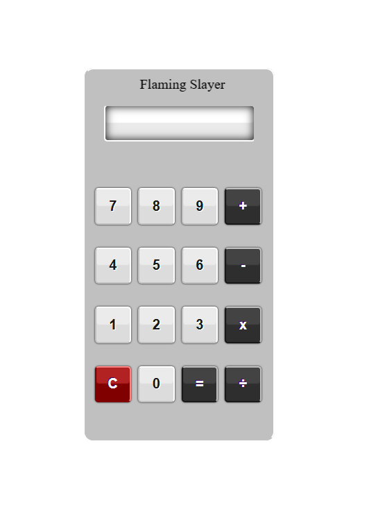

# Calculator

> A simple, responsive calculator built with **HTML** and **CSS**.

**Live Demo:** https://flamingcalculator.netlify.app/


---

## Features

- Clean and simple UI
- Responsive design (mobile + desktop)
- Built using only **HTML + CSS**
- One-click navigation to the calculator page

---

## Preview

<p align="center">
  
</p>

---

## Tech Stack

| Layer | Technology |
|------|------------|
| Frontend | HTML5, CSS3 |

---

## Project Structure

```text
Calculator/
├── index.html
├── J.html
├── assets/
│   └── preview.png
└── README.md
```

---

## Run Locally

### 1) Clone the repository
```bash
git clone https://github.com/FlamingSlayer/Calculator.git
cd Calculator
```

### 2) Open in browser
Open `index.html` in any browser.

---

## Support

- Issues: https://github.com/FlamingSlayer/Calculator/issues
- Telegram: https://t.me/flamingvj

---

Built by **Flaming / VidhyanJha**